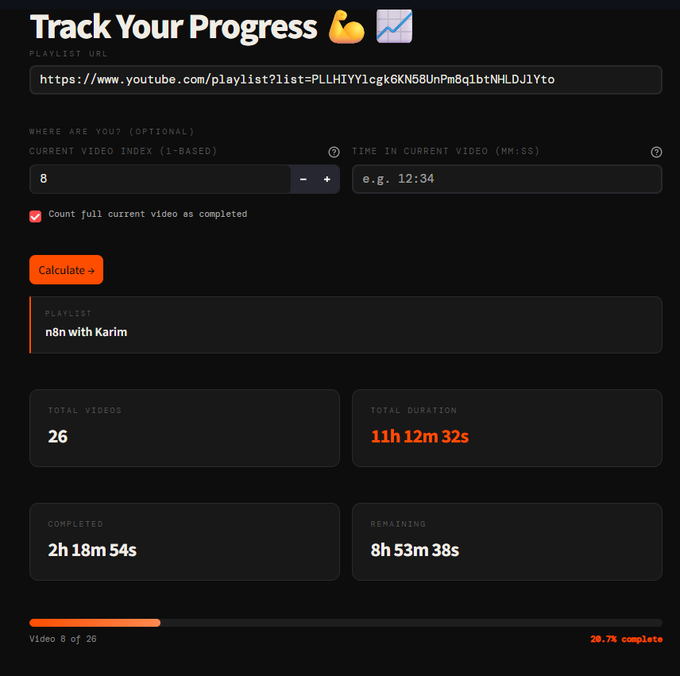

# 📺 YouTube Playlist Tracker
<p align="center">
  
</p>

A clean, lightweight Streamlit app that calculates the **total duration of any YouTube playlist** and helps you track your progress through it.

Perfect for learners, binge-watchers, and anyone trying to actually finish those long “watch later” playlists.

---

## ✨ Features

- 📊 **Total playlist duration** — instantly calculate full watch time  
- 🎯 **Progress tracking** — see how far you are in the playlist  
- ⏱️ **Partial video tracking** — support for `mm:ss` timestamps  
- ✅ **Flexible completion mode** — count full or partial video progress  
- ⚡ **Fast lightweight UI** — built with Streamlit  
- 🌙 **Dark modern interface** — clean, minimal design  

---

## 🧠 How it works

The app:
- Fetches all video durations from a YouTube playlist
- Computes total runtime
- Calculates progress using:
  - Current video index (1-based)
  - Optional timestamp inside the current video
- Displays completed vs remaining time with a progress bar

---

## 📁 Project Structure

```
youtube-playlist-tracker/
│
├── app.py                # Streamlit UI (main entry point)
├── requirements.txt      # Dependencies
├── README.md
├── .gitignore
│
└── utils/
    ├── __init__.py       # Public exports
    ├── components.py
    ├── styles.css
    └── youtube.py       # Core logic (fetching + calculations)
```

---

## 🚀 Getting Started

### 1. Clone the repository

```bash
git clone https://github.com/your-username/youtube-playlist-tracker.git
cd youtube-playlist-tracker
```

---

### 2. Create a virtual environment (recommended)

```bash
python -m venv .venv
```

Activate it:

**Windows**
```bash
.venv\Scripts\activate
```

**Mac/Linux**
```bash
source .venv/bin/activate
```

---

### 3. Install dependencies

```bash
pip install -r requirements.txt
```

---

### 4. Run the app

```bash
streamlit run app.py
```

---

## 🧭 How to use

1. Paste a **YouTube playlist URL**
2. (Optional) Enter:
   - Current video index (1-based)
   - Timestamp in current video (`mm:ss`)
3. Choose whether to count the current video as fully watched
4. Click **Calculate →**
5. View:
   - Total duration
   - Completed time
   - Remaining time
   - Progress bar

---

## 📌 Use cases

- 🎓 Tracking online courses and lectures  
- 🎧 Managing podcast playlists  
- 📺 Planning binge-watching sessions  
- ⏳ Understanding total content consumption  

---

## ⚠️ Notes

- Private or deleted videos are skipped automatically  
- Requires internet connection  
- Works best with public playlists  

---

## 🛠 Tech Stack

- Python  
- Streamlit  
- YouTube playlist parsing utilities  

---

## 💡 Future ideas

- Save and resume progress per playlist  
- User history dashboard  
- Export stats (CSV / JSON)  
- Chrome extension version  
- Mobile-first UI improvements  

---
